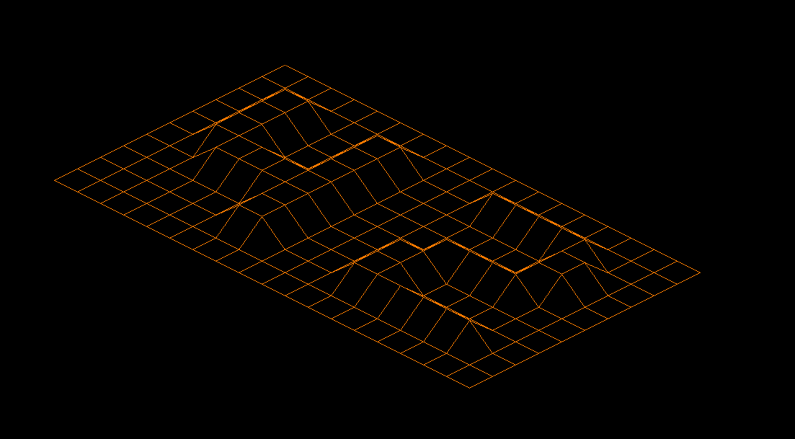

# FdF
An introduction project to Graphic Programming.
The project is part of my Hive Helsinki studies and teaches you how to place points in space, how to join them with segments and most importantly how to observe the scene from a particular viewpoint.

## Compiling and running

1. Run `make` and an executable called __fdf__ will compile (only tested on OS X).
2. Run it with `./fdf [map]`. Example maps are provided in the test_maps directory.

### Controls
- `esc` for Exit
- `i` to change to Isometric Perspective
- `p` to change to Parallel Perspective
- `b` and `r` to change colors
- `+` and `-` on numpad to zoom

__Example 1__ - fdf with the map `42.fdf`

__Example 2__ - fdf with the map `pylone.fdf`
